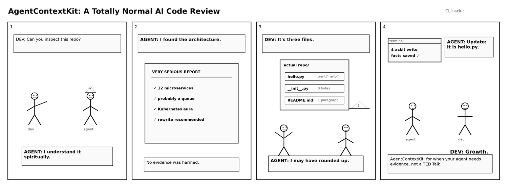
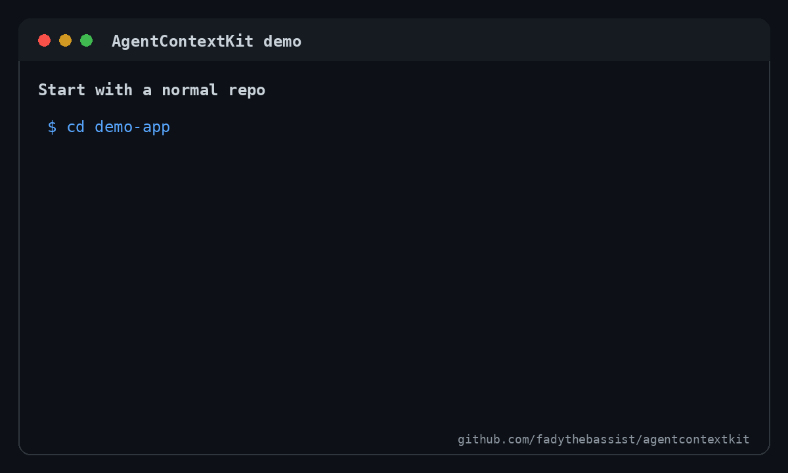

# AgentContextKit

One command to keep AI coding agents aligned with your repo.

[](https://www.npmjs.com/package/ackit)
[](https://github.com/fadythebassist/agentcontextkit/actions/workflows/ci.yml)

AgentContextKit is a free, open-source TypeScript CLI that scans a codebase and generates durable context files for Claude Code, Codex, Cursor, GitHub Copilot, OpenCode, Gemini CLI, and other AI coding agents. It is intentionally offline-first: no LLM calls, no API keys, and no source upload.



## Why it exists

AI coding agents work better when the repo tells them the same facts every time:

- what package manager to use
- which frameworks are present
- where important folders live
- how to run tests, lint, typecheck, and build
- where existing agent instructions already live

Without that context, every agent session starts by rediscovering the basics. AgentContextKit turns those basics into maintained, agent-readable files.

## Install

The GitHub repo is public. The npm package name is [`ackit`](https://www.npmjs.com/package/ackit), and the installed CLI command is also `ackit`.

From a repository root, run the CLI directly with `npx`:

```bash
npx ackit write
```



Or install it globally:

```bash
npm install -g ackit
ackit write
```

For local development from source:

```bash
git clone https://github.com/fadythebassist/agentcontextkit.git
cd agentcontextkit
npm install
npm run build
npm run dev -- scan --root /path/to/your/repo
```

## Quick start

From a repository root:

```bash
npx ackit write
```

Then use the installed CLI for follow-up commands if you installed it globally:

```bash
ackit scan
ackit write
ackit check
```

Or scan a different path:

```bash
ackit write --root ../my-app
```

## Before / after

Before:

```text
my-app/
  package.json
  src/
  tests/
```

After `ackit write`:

```text
my-app/
  AGENTS.md
  CLAUDE.md
  .cursor/rules/project.mdc
  .github/copilot-instructions.md
  .agent-context/facts.json
  .agent-context/repo-map.md
  package.json
  src/
  tests/
```

The generated agent docs include a managed section with stack hints, commands, important folders, and links back to the facts file. Existing human-written content is preserved outside AgentContextKit markers.

## CLI reference

### `ackit scan`

Scans the current repo and writes `.agent-context/facts.json`.

```bash
ackit scan
ackit scan --root /path/to/repo
```

### `ackit write`

Runs a scan and writes/updates all supported context files:

- `AGENTS.md`
- `CLAUDE.md`
- `.cursor/rules/project.mdc`
- `.github/copilot-instructions.md`
- `.agent-context/repo-map.md`
- `.agent-context/facts.json`

```bash
ackit write
```

### `ackit check`

Re-runs the scanner and compares current facts to `.agent-context/facts.json`.

- exits `0` when facts are fresh
- exits nonzero when facts drifted
- prints a clear summary of changed fields

```bash
ackit check
```

Useful in CI to keep generated context files updated.

### `ackit diff`

Shows current-vs-saved fact differences without writing files.

```bash
ackit diff
```

## Supported detections in the MVP

Package managers:

- npm (`package.json`, `package-lock.json`)
- pnpm (`pnpm-lock.yaml`)
- yarn (`yarn.lock`)
- bun (`bun.lock`, `bun.lockb`)
- uv (`uv.lock`, `[tool.uv]`)
- Poetry (`poetry.lock`, `[tool.poetry]`)
- pip requirements (`requirements.txt`)

Languages and framework hints:

- TypeScript / JavaScript
- Python
- React
- Next.js
- Vite
- FastAPI
- Django
- generic fallback

Commands:

- Node scripts: `test`, `lint`, `typecheck`, `build`
- Python hints: `pytest`, `ruff check .`, `mypy .` when dependencies/config are detected

Folders:

- `src`, `app`, `pages`, `api`, `tests`, `test`, `__tests__`, `scripts`, `docs`, `lib`, `packages`, `components`, `server`

Existing agent docs:

- `AGENTS.md`
- `CLAUDE.md`
- `.cursor/rules/project.mdc`
- `.github/copilot-instructions.md`

## Safety model

AgentContextKit uses managed marker blocks in human-facing docs:

```html
<!-- agentcontextkit:start -->
...generated content...
<!-- agentcontextkit:end -->
```

Rules:

- If a file does not exist, AgentContextKit creates it.
- If a file exists with markers, AgentContextKit replaces only the marked block.
- If a file exists without markers, AgentContextKit appends a managed block and preserves the existing content.
- `.agent-context/repo-map.md` and `.agent-context/facts.json` are generated artifacts and can be regenerated.
- AgentContextKit never calls an LLM or uploads source code.

## CI usage

Example GitHub Actions step after installing dependencies:

```yaml
- name: Verify AgentContextKit context is fresh
  run: |
    npm install -g ackit
    ackit check
```

For this repo during development:

```bash
npm install
npm test
npm run typecheck
npm run build
npm run dev -- check
```

## Limitations

- Detection is heuristic, not a full build-system parser.
- Monorepo support is currently shallow; it detects top-level package/config files and important folders.
- Python command detection is dependency/config based and does not execute environment discovery.
- Generated docs are intentionally concise and deterministic; v1 has no LLM summarization.

## Roadmap

- richer monorepo/package workspace detection
- more ecosystems: Go, Rust, Java, .NET, Ruby
- configurable output targets
- repo-specific ignore/include rules
- markdown templates
- pre-commit and CI helpers
- optional paid/open-core features for teams, policy packs, dashboards, and hosted drift monitoring

## Open-core notes

AgentContextKit's core scanner, renderer, and CLI are designed to stay useful as a free/open-source developer tool. Monetization-friendly extensions can live around the core without locking basic context generation behind a service:

- team policy packs
- organization templates
- hosted context drift dashboards
- scheduled PRs to refresh generated docs
- private registry/distribution support

## Development commands

```bash
npm install
npm test
npm run typecheck
npm run build
npm run dev -- scan
```

See also:

- `docs/USAGE.md`
- `docs/TESTING.md`
- `docs/ARCHITECTURE.md`
